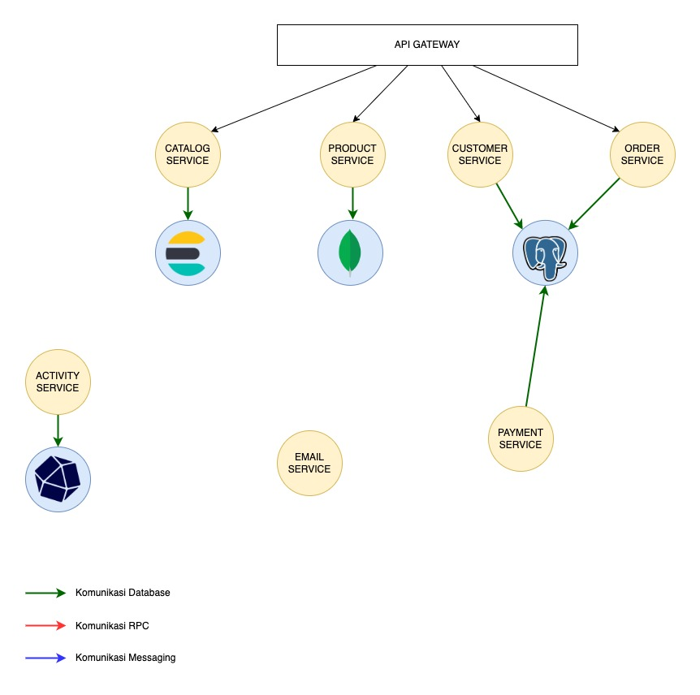
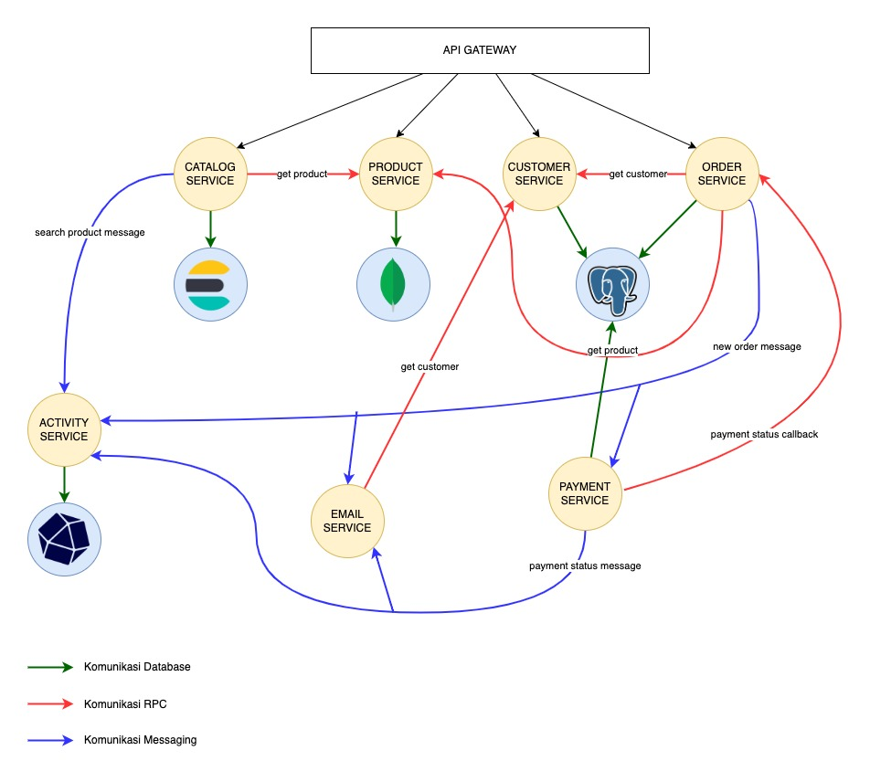

# Day 23 - Microservices

## Problem 1 - Cenralized and Decentralized Database

Pada arsitektur aplikasi ini terdapat 7 service.
1. Catalog service bertugas menangani pencarian produk, oleh sebab itu service ini dituntut untuk dapat melakukan query dengan cepat, sehingga service ini diputuskan untuk melakukan database perservice dengan elasticsearch sebagai databasenya.
2. Product service bertugas untuk menyimpan produk, dikarenakan data produk memiliki attribute yang beragam dan berbeda-beda pada setiap jenis/kategori barang, maka service ini melakukan database perservice dengan database mongodb (nosql document oriented) sebagai databasenya.
3. Customer service bertugas menangani data-data customer, service ini menggunakan database postgressql sharing dengan order service dikarenakan data customer cenderung memiliki attribute yang sama.
4. Order service bertugas untuk menangani pemesanan, dikarenakan proses memiliki banyak langkah dan harus sinkron (misalnya ketika salah satu proses terdapat error dapat dirollback) maka digunakanlah postgressql
5. Activity service bertugas mencatat aktivitas customer seperti riwayat login, belanja, pencarian product dlsb. Oleh sebab itu digunakanlah timeseries database yakni influxdb
6. Email service bertugas mengirimkan email kepada customer, service ini bersifat stateless yang berarti service ini tidak membutuhkan database
7. Payment service bertugas menangani pembayaran bekerjasama dengan pihak lain seperti bank, payment gateway dlsb. Service ini menggunakan database postgressql sharing dengan service customer dan order.

## Problem 2 - Service Communication

Supaya antar service dapat berkomunikasi dan bertukar data, maka dibuatlah rancangan komunikasi via RPC yang diwakili dengan garis berwarna merah dan Messaging yang diwakili garis berwarna biru.

Penentuan komunikasi via RPC diperuntukan untuk komunikasi antar service yang membutuhkan response (bersifat syncrhronous). Sedangkan penentuan komunikasi antar service via messaging memiliki pertimbangan bahwa service tidak membutuhkan response dari service yang dituju, serta untuk menghindari pengiriman data yang sama berkali-kali keberbagai service.